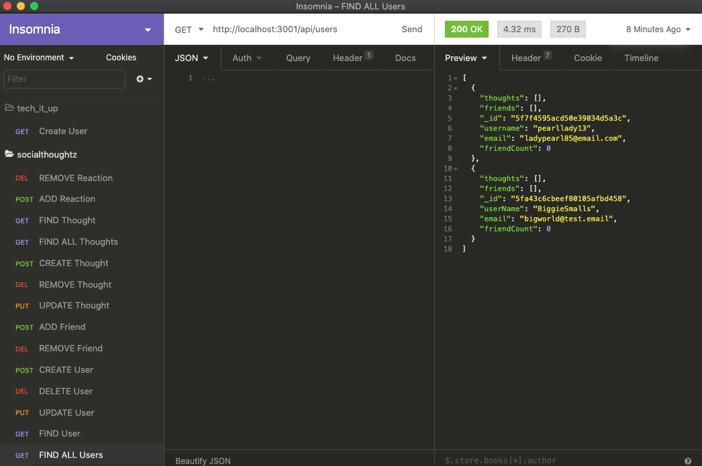

# SocialThoughtz
This application is the back-end framework of a social network where users can share their thoughts, react to friends' thoughts, and create a friend list. A walkthrough video is included to demonstrate functionality. 

## Table of Contents
* [Technologies](#technologies)
* [WalkthroughVideo](#walkthroughvideo)
* [Deployment](#deployment)
* [Questions](#questions)

## Technologies
* Express.js
* MongoDB
* Mongoose
* Moment.js
* Insomnia

## Walkthrough Video

[Video](https://drive.google.com/file/d/1ukBukD6ji1lwOBhWLuHJ1cqCGZps3MiX/view)

## Start Screen - Insomnia

## Questions
Visit my [github](https://github.com/sidoniag) 
Questions here: <seekersig@gmail.com>